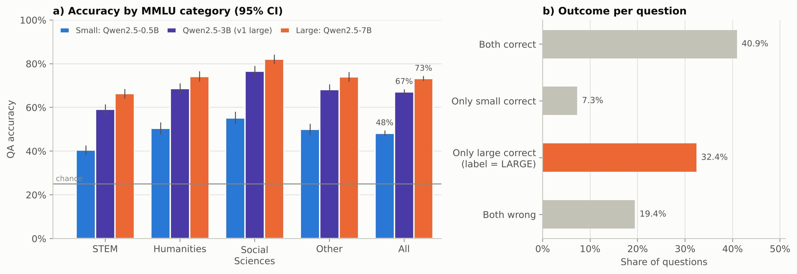
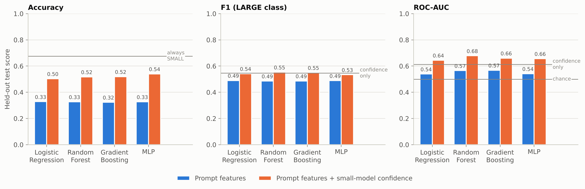
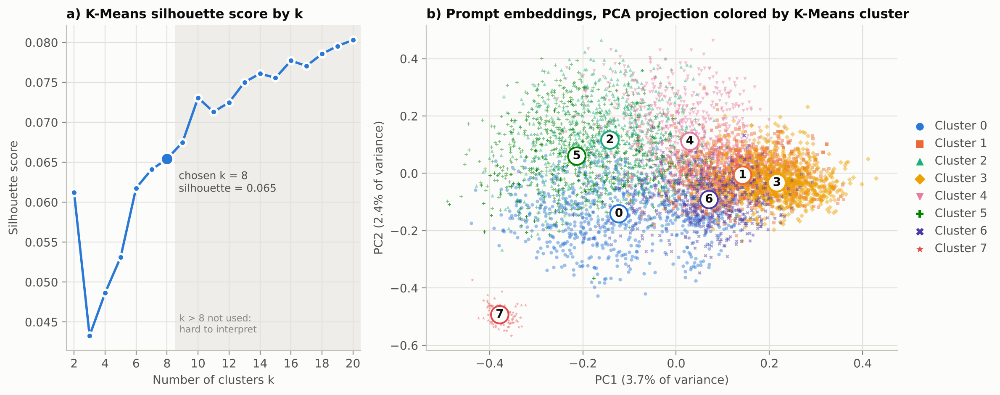
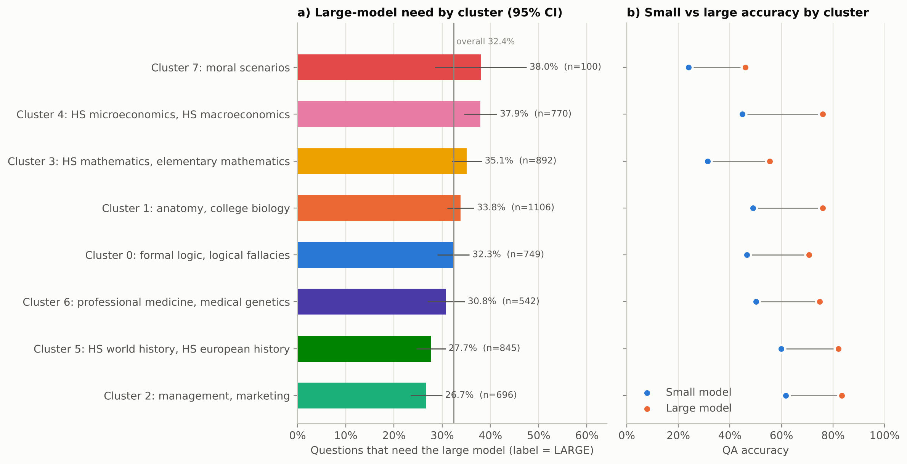
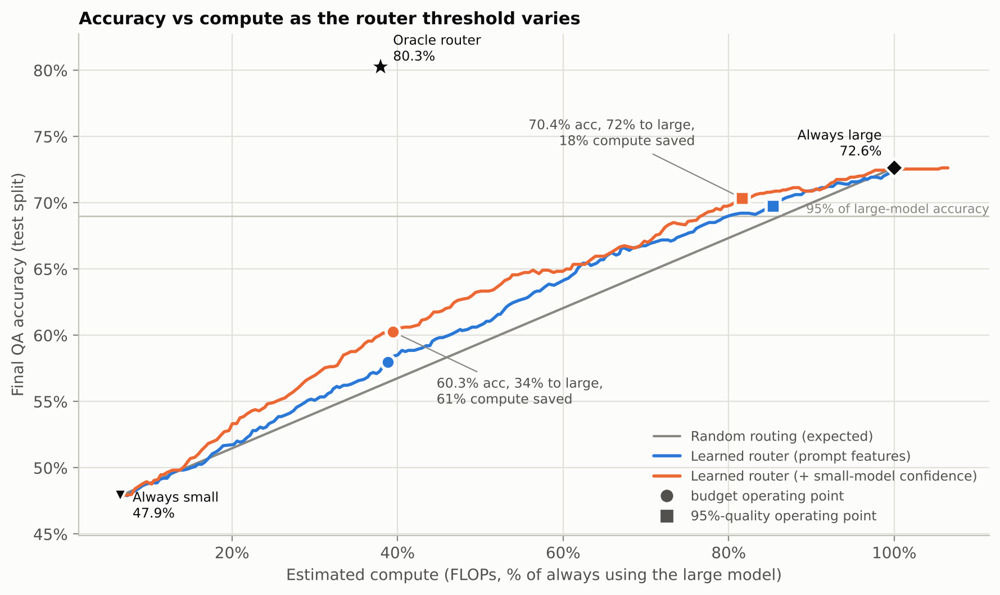

# Adaptive LLM Router: Predicting When a Small Model Is Enough

**Summary.** We ran 5,700 MMLU questions through Qwen2.5 models of 0.5B, 3B and 7B
parameters. Each question was labelled `LARGE` when only the large model (7B) answered
correctly, and we trained routers to predict that label. Four classifiers were compared:
Logistic Regression, Random Forest, Gradient Boosting and an MLP.

- **Prompt features alone carry little signal.** The best test ROC-AUC is 0.57.
- **The small model's own confidence lifts this to 0.68.** Used as a cascade, the Random
  Forest router recovers performance gaps in the same range as the best published routers
  on MMLU. Its APGR is 0.62 on test (0.59 in cross-validation), and it needs **34% of
  large-model calls** to recover half the small→large accuracy gap (38% in
  cross-validation; RouteLLM's best: 35%).
- **At a budget of 34% of questions escalated**, it reaches **60.3% accuracy**, compared
  with 47.9% always-small and 72.6% always-large. That saves **61% of the large model's
  compute**, and is **+4.0 points over random routing** (95% CI +2.2 to +6.0).
- **Clustering prompt embeddings** shows large-model need varies by topic, from 26.7% to
  38.0% (χ² p < 0.001). Mid-difficulty topics such as economics benefit most.

---

## 1. Introduction / Background

Large language models (LLMs) become more accurate as they grow, but every answer from a
bigger model costs more computation, latency, energy and money. Most questions do not need
the biggest model. **LLM routing** sends each query to the cheapest model that can answer
it.

**Related work.**

- **FrugalGPT** [2] chains models from cheap to expensive. A learned scorer accepts or
  rejects each answer, and the authors report large cost savings at GPT-4-level accuracy.
- **Hybrid LLM** [3] trains a BERT-style router to predict the quality gap between a small
  and a large model. It routes before any model runs, with a tunable quality–cost trade-off.
- **RouteLLM** [4] learns routers from human preference data. It introduces the APGR and
  CPT metrics we also report.
- **AutoMix** [5] routes using a small model's self-verification.
- **RouterBench** [6] standardizes how routers are evaluated, with accuracy–cost curves
  against oracle and random baselines.
- **Kadavath et al.** [7] show that language models are partially *calibrated*: their own
  token probabilities indicate when they are likely to be wrong. That observation is what
  confidence-based cascades rely on.

**Dataset.** MMLU [1]
([huggingface.co/datasets/cais/mmlu](https://huggingface.co/datasets/cais/mmlu)) contains
four-option multiple-choice questions in 57 subjects, from elementary math to professional
law. We sample **100 test questions per subject (5,700 questions)**. Each one is answered by
three open models from the Qwen2.5 family [8]. Every question gets five kinds of features:

- prompt length
- number and math-symbol counts
- the MMLU super-category (STEM, Humanities, Social Sciences, Other)
- a 384-dimensional sentence embedding [9], [10]
- the small model's confidence in its own answer

## 2. Problem Definition

Given a question *x*, a small model *S* and a large model *L*, decide **before calling *L***
whether *S*'s answer is good enough. We frame this as binary classification:

- **`LARGE`** (1): *S* is wrong and *L* is right
- **`SMALL`** (0): otherwise

If both models are wrong, escalating costs more and fixes nothing, so it counts as `SMALL`.

The classifier's score drives a routing policy. Success is measured with three metrics:

- **Final QA accuracy.**
- **Share of questions sent to *L*.**
- **Compute saved** relative to always using *L*.

The policy is compared against always-small, always-large and random routing at the same
budget.

**Why it matters (sustainability).** Luccioni et al. [11] measured the energy of serving
models. They found that large general-purpose generative models cost orders of magnitude more
energy per inference than smaller task-specific systems. Each query a router answers with the
small model avoids most of that cost, and no model has to be retrained.

## 3. Methods

### 3.1 Data collection and labels

All three Qwen2.5-Instruct models [8] answer every question zero-shot with the same prompt:

```
The following is a multiple choice question about {subject}.

{question}
A. {choice A}
B. {choice B}
C. {choice C}
D. {choice D}
Answer:
```

Each model's answer is the option letter whose token (` A` … ` D`) has the highest
next-token score. The softmax over those four scores is the model's probability for each
option.

| Role | Model | Parameters | How it runs (4-core CPU) | Mean latency per question |
|---|---|---:|---|---:|
| Small | Qwen2.5-0.5B-Instruct | 0.49 B | PyTorch, bfloat16 | 0.13 s |
| Large, v1 | Qwen2.5-3B-Instruct | 3.09 B | PyTorch, bfloat16 | 0.62 s |
| **Large, v2 (main)** | **Qwen2.5-7B-Instruct** | **7.62 B** | llama.cpp [14], 4-bit (Q4_K_M) | 2.12 s |

The 7B model does not fit in 15 GB of RAM in bfloat16, so it runs 4-bit quantized. The 3B
model was the large model in our first iteration (Section 4.6) and is kept for comparison.

**Split.** 80/20 train/test split, stratified on the label (4,560 / 1,140 questions). All
model selection and every routing threshold use only the training split, through 5-fold
cross-validation. The test split is used once, for the final numbers.

### 3.2 Preprocessing

Five preprocessing methods run inside a scikit-learn [12] `Pipeline`/`ColumnTransformer`.
Everything is re-fitted in every cross-validation fold, so no test information leaks:

1. **Log transform** of the right-skewed counts (prompt tokens, numbers, math symbols).
2. **Standardization** (z-scores) of all numeric features.
3. **One-hot encoding** of the MMLU category.
4. **Sentence embeddings:** all-MiniLM-L6-v2 [9], [10] maps each question and its options to
   a 384-d vector.
5. **PCA** reduces the embedding to 32 whitened components. This keeps 384 noisy dimensions
   from swamping the other features.

There are two feature sets:

- **Prompt features:** length, counts, category and embedding. These are available before any
  LLM runs.
- **Prompt + small-model confidence:** adds the small model's top probability, its margin
  over the runner-up, and the entropy of its answer distribution. Kadavath et al. [7] show
  these track correctness. Using them makes the router a **cascade**: the small model always
  runs, and escalated questions pay for both models.

### 3.3 Supervised models

Four scikit-learn classifiers predict P(`LARGE`). Each is tuned by grid search with 5-fold
stratified cross-validation on ROC-AUC:

| Model | Why it should work | Grid |
|---|---|---|
| Logistic Regression | Strong, interpretable baseline. Confidence and difficulty act roughly monotonically on the log-odds. | C ∈ {0.003, 0.01, 0.03, 0.1, 1}, balanced class weights |
| Random Forest | Captures non-linear interactions (e.g. low confidence *and* a math topic); robust to unscaled, noisy features. | depth {6, 12, none} × min leaf {1, 5, 20}; 400 trees |
| Gradient Boosting (histogram) | Usually the strongest model on tabular data; corrects the forest's residual errors. | learning rate {0.03, 0.1} × leaves {7, 15, 31} × L2 {0, 1} |
| MLP | Learns its own interactions between embedding components. | layers {(32), (64, 32)} × L2 α {0.001, 0.01, 0.1, 1}; early stopping |

Accuracy and F1 need a hard decision, so each model uses the threshold that maximizes F1 on
out-of-fold training predictions.

### 3.4 Unsupervised models

All 5,700 embeddings are reduced to 50 dimensions with PCA (49% of the variance kept).
K-Means (10 restarts) then runs for k = 2 to 20, scored by silhouette [13]. Labels are never
used in fitting. They are joined afterwards, and a χ² test checks whether large-model need
differs between clusters.

### 3.5 Routing evaluation

The router escalates a question when P(`LARGE`) is at or above a threshold. Two operating
points are chosen **on out-of-fold training predictions only**, then applied unchanged to the
test split:

- **Budget:** escalate the same share of questions as the training `LARGE` rate.
- **95% quality:** the cheapest threshold that keeps 95% of the large model's accuracy.

**Baselines.**

- Always small.
- Always large.
- Random routing at the same share (mean of 1,000 draws). A paired bootstrap over test
  questions gives the router's gain over random with a 95% CI.
- Confidence alone (no learning).
- Oracle: escalates exactly the `LARGE` questions.

**Curve-level metrics** [4]. PGR (performance gap recovered) = (accuracy − small) /
(large − small).

- **APGR:** the area under PGR as the share of large-model calls sweeps from 0 to 100%.
  Random routing scores 0.5.
- **CPT(x%):** the share of calls needed to recover x% of the gap.

**Compute** is estimated as 2 × parameters × prompt tokens per forward pass, relative to
always-large. One small pass costs **6.5%** of a 7B pass. Measured CPU time is reported
alongside.

## 4. Results and Discussion

### 4.1 Model accuracy



**Figure 1.** (a) Accuracy of the three models by MMLU category, with 95% confidence
intervals. (b) How the small and large (7B) models' outcomes combine; the orange bar is the
`LARGE` class.

| Category | Questions | 0.5B | 3B | 7B | `LARGE` rate (vs 7B) |
|---|---:|---:|---:|---:|---:|
| STEM | 1,800 | 40.4% | 59.1% | 66.3% | 35.2% |
| Humanities | 1,300 | 50.5% | 68.6% | 74.2% | 30.3% |
| Social Sciences | 1,200 | 55.3% | 76.6% | 82.1% | 32.3% |
| Other | 1,400 | 50.0% | 68.1% | 74.0% | 30.8% |
| **All** | **5,700** | **48.2%** | **67.2%** | **73.3%** | **32.4%** |

Accuracy rises with size in every category. The 7B is 25 points better than the 0.5B overall.

Per question, the outcomes break down as follows:

- **Both correct (40.9%) and only-small-correct (7.3%):** the small model already gets these
  right.
- **Only-large-correct (32.4%):** the `LARGE` class, the questions worth escalating.
- **Both wrong (19.4%):** escalating these costs more and gains nothing.

The `LARGE` rate ranges from 16% (marketing) to 48% (high-school microeconomics) across
subjects.

### 4.2 Supervised results

| Features | Model | CV ROC-AUC (train) | Test accuracy | Test F1 | Test ROC-AUC |
|---|---|---:|---:|---:|---:|
| – | Majority class (always `SMALL`) | 0.500 | 0.676 | 0.000 | 0.500 |
| confidence only | Threshold on small-model confidence | 0.633 | 0.498 | 0.546 | 0.613 |
| prompt | Logistic Regression | 0.549 ± 0.012 | 0.328 | 0.490 | 0.539 |
| prompt | **Random Forest** | **0.558 ± 0.007** | 0.327 | 0.486 | 0.565 |
| prompt | Gradient Boosting | 0.541 ± 0.015 | 0.324 | 0.486 | 0.568 |
| prompt | MLP | 0.549 ± 0.012 | 0.327 | 0.488 | 0.542 |
| prompt + confidence | Logistic Regression | 0.636 ± 0.021 | 0.503 | 0.542 | 0.644 |
| prompt + confidence | **Random Forest** | **0.641 ± 0.019** | 0.518 | **0.554** | **0.678** |
| prompt + confidence | Gradient Boosting | 0.638 ± 0.022 | 0.519 | 0.550 | 0.661 |
| prompt + confidence | MLP | 0.641 ± 0.026 | **0.540** | 0.534 | 0.657 |

Bold models were selected by cross-validated ROC-AUC and are used as routers. The selected
hyperparameters are in `results/supervised_metrics.csv`.



**Figure 2.** Test accuracy, F1 and ROC-AUC for the four classifiers on both feature sets.
Gray lines mark always-`SMALL` (accuracy), confidence alone (F1, ROC-AUC) and chance.

**What the metrics show.**

- **Features matter far more than the classifier.** All four models land within about 0.03
  ROC-AUC of each other on the same features, which is about the cross-validation noise.
  Adding the confidence features moves every model by about 0.1.
- **Prompt features alone barely beat chance** (test ROC-AUC 0.54–0.57). At their
  F1-optimal thresholds these models flag about 99% of questions as `LARGE`. Their F1 (0.49)
  equals that of always predicting `LARGE` (2 · 0.324 / 1.324).
- **Accuracy misleads under class imbalance.** The majority class scores 0.68 while being
  useless as a router. This is why routers are judged on ROC-AUC and on the routing curves in
  Section 4.4.

**Model trade-offs.**

- **Random Forest** is best on ROC-AUC with confidence (0.678), and best in
  cross-validation on prompt features. Averaging many deep trees handles the noisy,
  interacting features without much tuning.
- **Gradient Boosting** is close (0.661). Its selected configuration is small (7 leaves,
  learning rate 0.03), a sign that there is little structure to fit beyond the main signals.
- **Logistic Regression** is a strong, interpretable baseline (0.644) and the cheapest to run.
- **The MLP** has the best accuracy at its threshold (0.540). Its ROC-AUC is mid-pack, and it
  is the least stable across folds (± 0.026).

**What the Random Forest relies on.** Grouped permutation importance is the drop in test
ROC-AUC when one feature group is shuffled:

| Feature group | Drop: prompt router | Drop: + confidence router |
|---|---:|---:|
| Small-model confidence | – | **0.151** |
| Embedding | **0.066** | 0.038 |
| Numbers | 0.000 | 0.011 |
| Category | 0.002 | 0.001 |
| Prompt length, math symbols | ≤ 0.001 | ≤ 0.001 |

**Why prompt features fail.** The same prompt-feature logistic regression was trained on
three different targets (5-fold CV on the training split):

| Target | Share positive | CV ROC-AUC |
|---|---:|---:|
| Small model is wrong | 51.7% | 0.640 |
| Large model is wrong | 26.5% | 0.667 |
| `LARGE` label (small wrong **and** large right) | 32.4% | 0.549 |

The features *do* recognize hard questions, but difficulty pushes the label both ways. A
harder question is more likely to beat the small model, and also more likely to beat the
large one. The router has to find questions that are hard for the small model yet easy for
the large one, a much narrower target.

### 4.3 Unsupervised results



**Figure 3.** (a) K-Means silhouette score for k = 2 to 20. (b) Prompt embeddings projected
on the first two principal components, colored and shaped by cluster; numbers mark each
cluster's median.

**Cluster structure is weak but topical.**

- **Silhouette scores are low** for every k (0.04–0.08) and rise slowly without a peak, so
  MMLU prompts form a continuum of topics rather than separate groups.
- **We use k = 8** (silhouette 0.065), the best value up to 8. Beyond that, clusters become
  hard to interpret.
- **The clusters still match subject groups** even though no labels were used.
- **One cluster stands apart.** Moral scenarios (cluster 7) shares a fixed question template
  and is the only cleanly separated cluster.

| Cluster | Main subjects | Questions | 0.5B accuracy | 7B accuracy | `LARGE` rate |
|---:|---|---:|---:|---:|---:|
| 7 | moral scenarios | 100 | 24.0% | 46.0% | **38.0%** |
| 4 | high-school micro-/macroeconomics, econometrics | 770 | 44.8% | 76.0% | **37.9%** |
| 3 | high-school and elementary math, college physics | 892 | 31.4% | 55.5% | 35.1% |
| 1 | anatomy, college biology, astronomy | 1,106 | 49.0% | 76.0% | 33.8% |
| 0 | formal logic, logical fallacies, professional law | 749 | 46.6% | 70.8% | 32.3% |
| 6 | professional medicine, medical genetics, virology | 542 | 50.2% | 74.9% | 30.8% |
| 5 | high-school world, European and US history | 845 | 59.9% | 82.1% | 27.7% |
| 2 | management, marketing, public relations | 696 | 61.6% | 83.5% | **26.7%** |



**Figure 4.** (a) Share of each cluster's questions that need the large model, with 95%
confidence intervals. (b) Small and large model accuracy per cluster.

**Large-model need differs significantly between clusters** (χ² = 35.5, 7 d.f.,
p < 0.001), from 26.7% to 38.0%.

- **Easy topics** (business, history) need escalation least: the small model already scores
  about 60%.
- **Mid-difficulty topics** need it most. In economics, the small model scores 45% and the
  7B scores 76%.
- **The hardest topics benefit less than their small-model accuracy suggests.** In math the
  7B also misses 45% of questions, so many are lost either way.

This is the same tension as Section 4.2. It is also why the learned router, which sees the
embedding, beats confidence alone: it learns which topics are worth escalating.

### 4.4 Routing results



**Figure 5.** Test accuracy against estimated compute as the router threshold sweeps from
"send nothing" to "send everything". Circles are the budget operating points, squares the
95%-quality points; the gray line is random routing. The cascade's curve passes 100% because
escalated questions pay for both models.

| Policy (1,140 test questions) | QA accuracy | Sent to 7B | Compute (FLOPs) | Compute saved | Gain over random at same share (95% CI) |
|---|---:|---:|---:|---:|---:|
| Always small | 47.9% | 0% | 6.5% | 93.5% | – |
| Always large | 72.6% | 100% | 100% | 0% | – |
| *Budget point* | | | | | |
| Random routing | 56.2% ± 0.9 | 33.7% | 38.1% | 61.9% | – |
| Confidence only (no learning) | 56.9% | 35.3% | 42.4% | 57.6% | +0.3 (−1.5 to +2.2) |
| Learned router, prompt features | 58.0% | 35.5% | 38.8% | 61.2% | +1.3 (−0.5 to +3.0) |
| **Learned router, + confidence (cascade)** | **60.3%** | 33.7% | 39.4% | **60.6%** | **+4.0 (+2.2 to +6.0)** |
| *95%-quality point* (target 69.0%) | | | | | |
| Learned router, prompt features | 69.7% | 83.3% | 85.4% | 14.6% | +1.2 (0.0 to +2.5) |
| **Learned router, + confidence (cascade)** | **70.4%** | 72.4% | 81.6% | **18.4%** | **+4.6 (+3.3 to +5.7)** |
| Oracle router (upper bound) | 80.3% | 32.4% | 37.9% | 62.1% | – |

Measured CPU time agrees with the FLOP estimate: the cascade saves 60.7% at the budget point
and 19.2% at the quality point.

| Router (curve over all thresholds) | APGR | CPT(50%) | CPT(80%) |
|---|---:|---:|---:|
| Random routing | 0.500 | 50.0% | 80.0% |
| Confidence only | 0.546 | 45.0% | 65.5% |
| Learned router, prompt features | 0.542 | 45.6% | 74.0% |
| **Learned router, + confidence (cascade)** | **0.623** | **34.0%** | **63.5%** |
| Same router, 5-fold CV on the training split | 0.591 | 38.0% | 67.5% |
| *RouteLLM routers trained with MMLU labels [4], best value per column (GPT-4 vs Mixtral 8x7B)* | *0.603* | *35.4%* | *70.3%* |

**What the results show.**

- **The cascade router is the clear winner.**
  - It beats random routing by 4.0 points at the budget point and 4.6 at the quality point;
    both CIs exclude zero.
  - It recovers half of the small→large gap with 34% of large-model calls on test (38% in
    cross-validation).
  - Its APGR (0.62 on test; 0.59 in 5-fold cross-validation on the training split) is in the
    range of RouteLLM's routers on MMLU. Those routers were also trained with MMLU labels and
    scored about 0.60. Their model pair and setup differ, so this is context, not a
    head-to-head comparison.
- **Learning beats raw confidence.** At the same budget, confidence alone is no better than
  random (+0.3). The learned router turns the same confidence into +4.0, because the
  embedding tells it which low-confidence questions are hopeless for both models.
- **Pre-generation routing remains hard.** The prompt-only router never runs the small model
  and so pays nothing extra. Its gain over random (+1.3) is not significant, and its APGR
  (0.54) is close to RouteLLM's routers trained without MMLU data (≈ 0.50).
- **Keeping 95% of quality is expensive.** The cascade reaches 70.4% (97% of the 7B's
  accuracy) but saves only 18% of compute. Most of the remaining gap sits in questions the
  router cannot tell apart.
- **The oracle shows the headroom.** At 38% compute it reaches 80.3%, beating always-large,
  because in 7.3% of questions only the small model is right.

**A fair alternative: just use the 3B model.** Running the 3B on everything costs 40.5% of
the 7B's compute and scores 66.3% on the same test questions. At that compute, our cascade
router reaches only 60.5%. With a router of this accuracy (ROC-AUC 0.68), a single mid-size
model is the more efficient choice. Routing pays off once the router gets closer to the
oracle, which is the main target for future work.

### 4.5 Comparison across model sizes

The same untrained confidence-only cascade was run on the same test split with each large
model:

| Large model | Size | Small cost share | Always-large accuracy | `LARGE` rate | Both wrong | Confidence AUC | Confidence APGR |
|---|---:|---:|---:|---:|---:|---:|---:|
| Qwen2.5-3B | 3.09 B | 16.0% | 66.3% | 27.8% | 24.3% | 0.613 | 0.565 |
| Qwen2.5-7B | 7.62 B | 6.5% | 72.6% | 32.4% | 19.7% | 0.613 | 0.546 |

A larger model creates more questions worth escalating (32% vs 28%) and makes the cascade's
overhead small (6.5% vs 16%). The router's *relative* skill (AUC, APGR) does not change. Gains
in absolute accuracy and compute come from the stronger model; gains in APGR need a better
router.

### 4.6 Changes since the first iteration

The first version used the 3B model as the large model and three classifiers. We made four
changes:

1. **A stronger large model.** We switched to the 7B, run 4-bit through llama.cpp because it
   does not fit in memory otherwise.
2. **Two more confidence features:** the small model's margin and answer entropy.
3. **Gradient Boosting**, added as a fourth classifier.
4. **Better evaluation:** the 95%-quality operating point, APGR/CPT, and the confidence-only
   baseline.

v1 numbers are from `results/v1_large_3b/`, on that version's own test split:

| Cascade router | v1 (3B large) | v2 (7B large) |
|---|---:|---:|
| Always-large accuracy | 67.5% | 72.6% |
| Router test ROC-AUC | 0.660 | 0.678 |
| Accuracy at budget point | 56.3% | **60.3%** |
| Compute saved at budget point | 57.7% | **60.6%** |
| Gain over random at budget point | +3.2 | **+4.0** |
| APGR | 0.634 | 0.623 |

Two ideas did not help and were left out:

- **Hidden-state probe.** A logistic-regression probe on the 0.5B model's hidden states
  (layers 18 and 20) added ≤ 0.02 ROC-AUC over its confidence. This was a one-off check in
  the first iteration.
- **Three-class target.** Training on "escalation helps / no change / hurts" instead of the
  binary label gave the same or lower cross-validated APGR (Random Forest 0.587 vs 0.591).
  This was also a one-off check.

### 4.7 Limitations

- **Noisy labels.** A model at chance still answers 25% of four-option questions correctly,
  so some `LARGE` labels are lucky guesses. This matters most in near-chance clusters such
  as moral scenarios (small 24%).
- **One benchmark, one prompt format, one model family.** Free-form generation would make
  output tokens dominate cost, and confidence would have to come from sequence likelihoods.
- **Quantization.** The 7B runs 4-bit. That likely costs it about a point of accuracy, and
  CPU latency compares two different backends (PyTorch and llama.cpp).
- **Small test set.** 1,140 test questions give about ±3 points of uncertainty on accuracy.
  Differences between the four classifiers are within this noise.
- **Weak cluster structure.** Silhouette below 0.1 means k = 8 partly reflects a
  presentation choice.

### 4.8 Next steps

- **Debias the small model.** The 0.5B model favours "A" (35% of its answers, versus 24% of
  true answers) and rarely picks "D". Per-letter calibration [15] or answering with shuffled
  options would make its answers and confidence more reliable.
- **Three-tier cascade (0.5B → 3B → 7B).** Section 4.4 shows the 3B is a strong
  intermediate step.
- **A fine-tuned text encoder** to predict small-model errors directly from the question, in
  the spirit of Hybrid LLM [3].

## 5. References

[1] D. Hendrycks, C. Burns, S. Basart, A. Zou, M. Mazeika, D. Song, and J. Steinhardt, "Measuring massive multitask language understanding," in *Proc. Int. Conf. Learn. Represent. (ICLR)*, 2021.

[2] L. Chen, M. Zaharia, and J. Zou, "FrugalGPT: How to use large language models while reducing cost and improving performance," arXiv:2305.05176, 2023.

[3] D. Ding, A. Mallick, C. Wang, R. Sim, S. Mukherjee, V. Rühle, L. V. S. Lakshmanan, and A. H. Awadallah, "Hybrid LLM: Cost-efficient and quality-aware query routing," in *Proc. Int. Conf. Learn. Represent. (ICLR)*, 2024.

[4] I. Ong, A. Almahairi, V. Wu, W.-L. Chiang, T. Wu, J. E. Gonzalez, M. W. Kadous, and I. Stoica, "RouteLLM: Learning to route LLMs with preference data," arXiv:2406.18665, 2024.

[5] P. Aggarwal *et al.*, "AutoMix: Automatically mixing language models," arXiv:2310.12963, 2023.

[6] Q. J. Hu, J. Bieker, X. Li, N. Jiang, B. Keigwin, G. Ranganath, K. Keutzer, and S. K. Upadhyay, "RouterBench: A benchmark for multi-LLM routing system," arXiv:2403.12031, 2024.

[7] S. Kadavath *et al.*, "Language models (mostly) know what they know," arXiv:2207.05221, 2022.

[8] Qwen Team, "Qwen2.5 technical report," arXiv:2412.15115, 2024.

[9] N. Reimers and I. Gurevych, "Sentence-BERT: Sentence embeddings using Siamese BERT-networks," in *Proc. Conf. Empirical Methods Natural Lang. Process. (EMNLP-IJCNLP)*, 2019, pp. 3982–3992.

[10] W. Wang, F. Wei, L. Dong, H. Bao, N. Yang, and M. Zhou, "MiniLM: Deep self-attention distillation for task-agnostic compression of pre-trained transformers," in *Adv. Neural Inf. Process. Syst. (NeurIPS)*, 2020.

[11] A. S. Luccioni, Y. Jernite, and E. Strubell, "Power hungry processing: Watts driving the cost of AI deployment?" in *Proc. ACM Conf. Fairness, Accountability, Transparency (FAccT)*, 2024.

[12] F. Pedregosa *et al.*, "Scikit-learn: Machine learning in Python," *J. Mach. Learn. Res.*, vol. 12, pp. 2825–2830, 2011.

[13] P. J. Rousseeuw, "Silhouettes: A graphical aid to the interpretation and validation of cluster analysis," *J. Comput. Appl. Math.*, vol. 20, pp. 53–65, 1987.

[14] G. Gerganov *et al.*, "llama.cpp," GitHub repository, 2023. [Online]. Available: https://github.com/ggml-org/llama.cpp

[15] Z. Zhao, E. Wallace, S. Feng, D. Klein, and S. Singh, "Calibrate before use: Improving few-shot performance of language models," in *Proc. Int. Conf. Mach. Learn. (ICML)*, 2021.

---

*Reproduce with `SKIP_LLMS=1 ./run_pipeline.sh` (uses the committed LLM outputs) or
`./run_pipeline.sh` (re-runs all three LLMs, several hours on CPU). Every number above is in
`results/`, except the two one-off checks in Section 4.6.*
